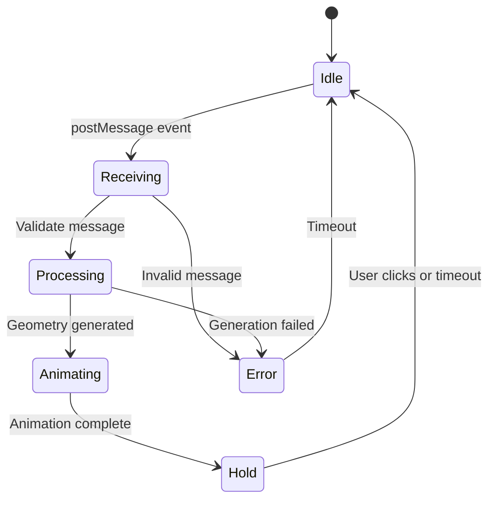

# Implementation Plan - Dynamic Text Geometry Animations
**Generated**: 2025-12-07 20:43:29
**Source STATUS**: STATUS-2025-12-07-203832.md
**Initiative**: dynamic-text-geometry-animations.md
**README Version**: Current (2025-12-07)

---

## Executive Summary

**Current State**: The text-to-path conversion system is fully functional (100% complete) with:
- ✅ opentype.js integration for text-to-SVG-path conversion
- ✅ Font loading system with caching (8 fonts configured)
- ✅ Gallery editor with font picker and text input
- ✅ Universal text animation with postMessage support
- ✅ 5 procedural animations supporting dynamic text (glitch, 3d-transforms, reveal-mask, wave-ripple, typewriter)

**Critical Issues Identified**:
1. **Font file corruption**: 3 of 8 font files (Oswald-Bold.ttf, Roboto-Bold.ttf, PermanentMarker-Regular.ttf) are corrupted ASCII dumps, not valid TrueType fonts
2. **Security vulnerability**: postMessage uses wildcard origin ('*') without validation

**Gap Analysis**: Per the initiative document, 4 animation types need dynamic text support:
- ❌ **Particles** (marked "easiest" - canvas sampling not implemented)
- ❌ **Liquid/Blobs** (marked "solved problem" - circle packing not implemented)
- ❌ **Morphing** (library suggested - path interpolation not implemented)
- ❌ **Line Drawing** (marked "hardest" - stroke extraction not attempted)

**Initiative Completion**: 45% (infrastructure complete, missing 4 animation types)

**Total Work Items**: 10 (P0: 2, P1: 2, P2: 2, P3: 4)

**Recommended Approach**:
1. Fix critical issues (fonts, security)
2. Implement "easy wins" (particles, liquid)
3. Evaluate morphing library integration
4. Defer line drawing (correctly identified as hardest)

---

## Priority Breakdown

### P0 (Critical) - 2 items
Foundation fixes that block functionality and pose security risks.

### P1 (High) - 2 items
High-value animation types from initiative: particles and liquid (marked "easiest" and "solved").

### P2 (Medium) - 2 items
Testing infrastructure and morphing implementation (requires library).

### P3 (Low) - 4 items
Documentation, validation, and line drawing exploration (lowest priority per initiative).

---

## Work Items

## P0 (Critical)

### P0-1: Replace Corrupted Font Files

**Status**: Not Started
**Complexity**: Small
**Dependencies**: None
**Spec Reference**: README.md (font support) • **Status Reference**: STATUS-2025-12-07-203832.md lines 520-581 ("Implementation Red Flags" > "Over-Engineering")

#### Description
Replace 3 corrupted font files that are currently ASCII text dumps instead of valid TrueType binaries. These files will cause opentype.js to fail when selected, breaking the dynamic text feature.

**Affected Files**:
- `/Users/bmf/code/loom99-animations/fonts/Oswald-Bold.ttf` (148KB ASCII dump)
- `/Users/bmf/code/loom99-animations/fonts/Roboto-Bold.ttf` (149KB ASCII dump)
- `/Users/bmf/code/loom99-animations/fonts/PermanentMarker-Regular.ttf` (149KB ASCII dump)

**Evidence from STATUS**:
```
File starts with:
2152 ++++++++++++++++++++
(NOT a valid TrueType header - should be binary)
```

**Root Cause**: Fonts were likely pasted as text or corrupted during file transfer.

**Solution**: Download valid TrueType fonts from Google Fonts or similar open-source repository.

#### Acceptance Criteria
- [ ] All 3 corrupted fonts replaced with valid .ttf binaries
- [ ] File verification: `file fonts/*.ttf` outputs "TrueType font data" for ALL fonts
- [ ] Test in browser: Select each font in gallery editor and generate text
- [ ] opentype.js successfully loads all 8 fonts without errors
- [ ] No console errors when switching between fonts

#### Technical Notes
**Download Sources**:
- Oswald: https://fonts.google.com/specimen/Oswald (select Bold weight)
- Roboto: https://fonts.google.com/specimen/Roboto (select Bold weight)
- Permanent Marker: https://fonts.google.com/specimen/Permanent+Marker (Regular weight)

**Verification Command**:
```bash
file fonts/*.ttf
# Expected output (all fonts):
# fonts/Anton-Regular.ttf: TrueType font data
# fonts/Oswald-Bold.ttf: TrueType font data  # (currently fails)
# fonts/Roboto-Bold.ttf: TrueType font data  # (currently fails)
# etc.
```

**Testing**:
1. Open index.html gallery
2. Open text-universal-paths.html in editor panel
3. Select each font from dropdown
4. Click "Generate" button
5. Verify text renders correctly without errors

---

### P0-2: Add postMessage Origin Validation

**Status**: Not Started
**Complexity**: Small
**Dependencies**: None
**Spec Reference**: Web security best practices • **Status Reference**: STATUS-2025-12-07-203832.md lines 451-461 ("LLM Blind Spot Findings" > "Security")

#### Description
Add origin validation to postMessage communication between gallery editor and animation iframes. Currently uses wildcard `'*'` which allows any malicious site to send updateTextPaths messages.

**Current Vulnerable Code** (index.html line 1959):
```javascript
iframe.contentWindow.postMessage({
    type: 'updateTextPaths',
    pathData: pathData
}, '*');  // ⚠️ VULNERABLE - accepts any origin
```

**Target Secure Pattern**:
```javascript
// Sender (index.html)
iframe.contentWindow.postMessage({
    type: 'updateTextPaths',
    pathData: pathData
}, window.location.origin);  // Only send to same origin

// Receiver (animations/*.html)
window.addEventListener('message', function(event) {
    // Validate origin
    const allowedOrigins = [
        window.location.origin,
        'http://localhost:8888',  // Dev server
        'http://127.0.0.1:8888'   // Alt localhost
    ];

    if (!allowedOrigins.includes(event.origin)) {
        console.warn('Rejected postMessage from unauthorized origin:', event.origin);
        return;
    }

    if (event.data && event.data.type === 'updateTextPaths') {
        // ... process message
    }
});
```

#### Acceptance Criteria
- [ ] Sender (index.html) uses `window.location.origin` instead of `'*'`
- [ ] All 6 receivers (animations with postMessage) validate `event.origin`
- [ ] Allowed origins: same origin + localhost dev server variants
- [ ] Invalid origins logged to console with warning (not silently ignored)
- [ ] Test: Verify postMessage still works in normal usage
- [ ] Test: Confirm rejection of messages from different origin (manual test with modified origin)

#### Technical Notes
**Files to Update**:
- **Sender**: `/Users/bmf/code/loom99-animations/index.html` (line ~1959 in applyTextToAnimation function)
- **Receivers** (6 files):
  1. animations/text/text-universal-paths.html
  2. animations/text/text-04-glitch-procedural.html
  3. animations/text/text-07-3d-transforms-procedural.html
  4. animations/text/text-08-reveal-mask-procedural.html
  5. animations/text/text-09-wave-ripple-procedural.html
  6. animations/text/text-10-typewriter-procedural.html

**Testing Approach**:
1. Normal case: Verify dynamic text still works after change
2. Security case: Use browser DevTools to manually send postMessage from different origin (should be rejected)
3. Dev server case: Test with localhost:8888 origin

**Edge Cases**:
- File:// protocol (local files): `event.origin === 'null'` - decide if allowed for local development
- HTTPS vs HTTP: Ensure origin matching is exact (protocol matters)

---

## P1 (High)

### P1-1: Implement Particle Animation Dynamic Text Support

**Status**: Not Started
**Complexity**: Low
**Dependencies**: P0-1 (font files), P0-2 (security)
**Spec Reference**: initiative lines 33-50 ("Particles (Moderate)") • **Status Reference**: STATUS-2025-12-07-203832.md lines 233-250 ("Missing: Particle Animations")

#### Description
Add dynamic text support to particle animations using canvas `fillText()` + `getImageData()` sampling. Initiative marks this as "easiest" and "mostly works already" - existing particle code just needs text input wired up.

**Current State**:
- Particle animations use hardcoded text
- Canvas sampling logic exists (`getImageData()`)
- No postMessage listener

**Target State**:
- Add postMessage listener to receive text + font
- Render text with canvas `fillText()`
- Re-sample particle positions
- Recreate particle array
- Restart animation

**Files to Update** (3 files):
- `animations/text/text-02-particles.html` (base)
- `animations/text/text-02-particles-varied.html`
- `animations/text/text-02-particles-procedural.html`

#### Acceptance Criteria
- [ ] All 3 particle files have postMessage listener
- [ ] Receive `{ type: 'updateText', text: string, fontFamily: string }` message
- [ ] Use canvas `fillText()` to render text with selected font
- [ ] Sample pixels with `getImageData()` at existing sampling density
- [ ] Create new particle array with sampled positions
- [ ] Restart animation with new particles
- [ ] Gallery editor sends font name (not font file path) for canvas font-family
- [ ] Test with all 8 fonts (verify particles form correct text shapes)
- [ ] Performance: Particle regeneration happens smoothly (<100ms)

#### Technical Notes

**Implementation Pattern** (from initiative):
```javascript
// Add to each particle animation file

window.addEventListener('message', function(event) {
    // (Add origin validation from P0-2)

    if (event.data && event.data.type === 'updateText') {
        const text = event.data.text;
        const fontFamily = event.data.fontFamily || 'Anton';

        // Clear canvas
        ctx.clearRect(0, 0, canvas.width, canvas.height);

        // Render new text
        ctx.font = `bold 80px ${fontFamily}`;
        ctx.fillStyle = '#fff';
        ctx.fillText(text, 50, 150);

        // Re-sample particles (existing function)
        particles = getTextPoints(ctx);

        // Restart animation
        restart();
    }
});
```

**Gallery Editor Changes** (index.html):
Need to send different message format for particles vs SVG path animations:
```javascript
// Detect if target animation is particle-based
const isParticleAnimation = iframe.src.includes('particles');

if (isParticleAnimation) {
    // Send text + font name (for canvas fillText)
    iframe.contentWindow.postMessage({
        type: 'updateText',
        text: text,
        fontFamily: fontName  // e.g., "Anton", "Roboto", etc.
    }, window.location.origin);
} else {
    // Send SVG path data (existing logic)
    iframe.contentWindow.postMessage({
        type: 'updateTextPaths',
        pathData: pathData
    }, window.location.origin);
}
```

**Font Name Mapping**:
Map font file names to CSS font-family names:
```javascript
const fontFamilyMap = {
    'Anton-Regular': 'Anton',
    'Roboto-Bold': 'Roboto',
    'Oswald-Bold': 'Oswald',
    'Bangers-Regular': 'Bangers',
    'Bungee-Regular': 'Bungee',
    'BlackOpsOne-Regular': 'Black Ops One',
    'PermanentMarker-Regular': 'Permanent Marker',
    'PressStart2P-Regular': 'Press Start 2P'
};
```

**Watch for**:
- Canvas fonts must be loaded before `fillText()` - use CSS @font-face and ensure fonts loaded
- Particle sampling may produce different densities for different fonts (adjust threshold if needed)
- Text positioning: Ensure text is fully visible in canvas bounds (adjust x/y if needed)

---

### P1-2: Implement Liquid/Blob Circle Packing for Dynamic Text

**Status**: Not Started
**Complexity**: Medium
**Dependencies**: P0-1 (font files), P0-2 (security)
**Spec Reference**: initiative lines 75-95 ("Liquid/Blobs (Moderate)") • **Status Reference**: STATUS-2025-12-07-203832.md lines 300-323 ("Missing: Liquid/Blob with Circle Packing")

#### Description
Add dynamic text support to liquid/blob animations using circle packing inside letter path shapes. Initiative marks this as "solved problem" - use point-in-polygon testing or d3-hierarchy pack layout.

**Current State**:
- Liquid animations use hardcoded blob positions
- Metaball/goo filter effects exist
- No postMessage listener

**Target State**:
- Receive text + font from gallery
- Get letter paths from opentype.js (or use existing textToSvgPaths)
- Pack circles inside letter shapes using algorithm
- Create blobs at circle positions
- Animate blobs merging into final letter shapes

**Files to Update** (3 files):
- `animations/text/text-05-liquid.html` (base)
- `animations/text/text-05-liquid-varied.html`
- `animations/text/text-05-liquid-procedural.html`

#### Acceptance Criteria
- [ ] All 3 liquid files have postMessage listener
- [ ] Receive path data (reuse existing `updateTextPaths` message from gallery)
- [ ] Implement circle packing algorithm (d3-hierarchy OR custom point-in-polygon)
- [ ] Generate blob positions inside letter shapes (not random placement)
- [ ] Blob density proportional to letter size (larger letters = more blobs)
- [ ] Maintain existing metaball/goo filter effects
- [ ] Animation: Blobs start scattered, merge into letter shapes
- [ ] Test with multiple word text (blobs fill all letters correctly)
- [ ] Performance: Circle packing completes quickly (<200ms for typical text)

#### Technical Notes

**Approach 1: Custom Point-in-Polygon** (Recommended - no library needed):
```javascript
window.addEventListener('message', function(event) {
    if (event.data && event.data.type === 'updateTextPaths') {
        const pathData = event.data.pathData;

        // For each letter path
        pathData.forEach(item => {
            const path = new Path2D(item.d);
            const bounds = item.bounds;

            // Generate random circle positions
            const blobs = [];
            const blobCount = Math.floor((bounds.x2 - bounds.x1) * (bounds.y2 - bounds.y1) / 500);

            let attempts = 0;
            while (blobs.length < blobCount && attempts < blobCount * 10) {
                const x = bounds.x1 + Math.random() * (bounds.x2 - bounds.x1);
                const y = bounds.y1 + Math.random() * (bounds.y2 - bounds.y1);

                // Check if point is inside path
                const ctx = document.createElement('canvas').getContext('2d');
                if (ctx.isPointInPath(path, x, y)) {
                    blobs.push(new Blob(x, y, radius, hue));
                }
                attempts++;
            }
        });

        restart();
    }
});
```

**Approach 2: d3-hierarchy Pack Layout** (More sophisticated):
```javascript
// Requires adding d3-hierarchy library
import { pack } from 'd3-hierarchy';

// Create hierarchical data from letter bounds
const hierarchy = {
    name: 'root',
    children: pathData.map(item => ({
        name: item.text,
        value: (item.bounds.x2 - item.bounds.x1) * (item.bounds.y2 - item.bounds.y1)
    }))
};

// Generate packed circles
const packLayout = pack().size([width, height]).padding(2);
const root = packLayout(d3.hierarchy(hierarchy).sum(d => d.value));

// Create blobs at packed positions
root.descendants().forEach(d => {
    if (d.depth > 0) {
        blobs.push(new Blob(d.x, d.y, d.r, hue));
    }
});
```

**Decision**: Use Approach 1 (point-in-polygon) for simplicity unless Approach 2 already has d3 available.

**Watch for**:
- Point-in-polygon may be slow for complex paths - limit attempt count
- Blob density: Too few = sparse letters, too many = performance hit
- Initial blob positions: Should start outside letter bounds for dramatic coalesce effect
- Goo filter performance: May degrade with many blobs (>100 per letter)

**Gallery Integration**:
Liquid animations should receive the same `updateTextPaths` message as SVG path animations (reuse existing infrastructure).

---

## P2 (Medium)

### P2-1: Create Test Infrastructure for Text Geometry System

**Status**: Not Started
**Complexity**: Medium
**Dependencies**: P0-1 (fonts), P1-1 (particles), P1-2 (liquid)
**Spec Reference**: Testing best practices • **Status Reference**: STATUS-2025-12-07-203832.md lines 400-434 ("Test Suite Assessment")

#### Description
Create comprehensive test suite for text-to-path conversion, font loading, postMessage communication, and animation state management. Currently no tests exist.

**Test Categories**:
1. **Unit Tests**: Core functions (textToSvgPaths, loadFont, particle sampling, circle packing)
2. **Integration Tests**: postMessage flow, font loading pipeline
3. **E2E Tests**: Browser automation (Playwright/Puppeteer) for visual verification

**Testing Framework**: Choose based on project constraints (suggest: Vitest for unit, Playwright for E2E)

#### Acceptance Criteria
- [ ] Test framework installed and configured
- [ ] Unit tests for `textToSvgPaths()` function (10+ test cases)
- [ ] Unit tests for `loadFont()` caching behavior (5+ test cases)
- [ ] Integration tests for postMessage flow (sender → receiver)
- [ ] E2E tests for at least 2 animation types (particles, universal paths)
- [ ] Visual regression tests for path generation (screenshot comparison)
- [ ] All tests passing on CI/local
- [ ] Code coverage report generated (target: >80% for core functions)
- [ ] Test documentation in README or separate TEST.md

#### Technical Notes

**Unit Test Examples** (textToSvgPaths):
```javascript
describe('textToSvgPaths', () => {
    test('empty string returns empty array', () => {
        const result = textToSvgPaths(font, '', 80);
        expect(result).toEqual([]);
    });

    test('single word generates single path', () => {
        const result = textToSvgPaths(font, 'HELLO', 80);
        expect(result).toHaveLength(1);
        expect(result[0]).toHaveProperty('d');
        expect(result[0]).toHaveProperty('text', 'HELLO');
    });

    test('multiple words generate multiple paths with correct Y spacing', () => {
        const result = textToSvgPaths(font, 'DO IT NOW', 80);
        expect(result).toHaveLength(3);
        expect(result[1].y).toBe(result[0].y + 80 * 1.2);
    });

    test('special characters handled without errors', () => {
        expect(() => textToSvgPaths(font, '!@#$%', 80)).not.toThrow();
    });
});
```

**Integration Test Examples** (postMessage):
```javascript
describe('postMessage communication', () => {
    test('gallery sends message to iframe', async () => {
        const iframe = document.createElement('iframe');
        iframe.src = 'animations/text/text-universal-paths.html';
        document.body.appendChild(iframe);

        await new Promise(resolve => iframe.onload = resolve);

        const messagePromise = new Promise(resolve => {
            iframe.contentWindow.addEventListener('message', resolve);
        });

        iframe.contentWindow.postMessage({
            type: 'updateTextPaths',
            pathData: [{ d: 'M0,0', text: 'A', color: '#fff', y: 80 }]
        }, '*');

        const event = await messagePromise;
        expect(event.data.type).toBe('updateTextPaths');
    });
});
```

**E2E Test Examples** (Playwright):
```javascript
test('user can generate custom text in gallery', async ({ page }) => {
    await page.goto('http://localhost:8888/index.html');

    // Find text-universal-paths card
    const card = page.locator('.animation-card').filter({ hasText: 'Universal Paths' });

    // Enter custom text
    await card.locator('.param-text').fill('HELLO');

    // Select font
    await card.locator('.param-font').selectOption('Anton-Regular');

    // Click generate
    await card.locator('.editor-btn-apply').click();

    // Verify iframe updated (check for SVG path elements)
    const iframe = card.locator('iframe');
    const paths = iframe.locator('svg path.text-path');

    await expect(paths).toHaveCount(1); // "HELLO" is one word
});
```

**Visual Regression Testing**:
- Use Playwright screenshot comparison
- Capture baseline images for each animation type
- Detect rendering changes automatically

**Setup**:
```bash
# Install dependencies
pnpm add -D vitest @vitest/ui playwright @playwright/test

# Create test files
mkdir tests/
touch tests/text-to-paths.test.js
touch tests/font-loading.test.js
touch tests/postmessage.test.js
touch tests/e2e.spec.js
```

---

### P2-2: Implement Morphing with Path Interpolation (flubber.js)

**Status**: Not Started
**Complexity**: Medium
**Dependencies**: P0-1 (fonts), P0-2 (security)
**Spec Reference**: initiative lines 51-73 ("Morphing (Hard)") • **Status Reference**: STATUS-2025-12-07-203832.md lines 280-298 ("Missing: Morphing with Path Interpolation")

#### Description
Add dynamic text support to morphing animations using flubber.js for arbitrary path interpolation. Initiative specifically recommends flubber.js to handle different point counts between shapes.

**Current State**:
- Morphing animations use hardcoded start/end paths with matched point counts
- Manual point matching is fragile and non-scalable
- No postMessage listener

**Target State**:
- Add flubber.js library
- Start with simple shape (circle, square)
- Morph into letter shapes from opentype.js
- Handle multiple letters with separate interpolators
- Animate with smooth interpolation

**Files to Update** (3 files):
- `animations/text/text-03-morphing.html` (base)
- `animations/text/text-03-morphing-varied.html`
- `animations/text/text-03-morphing-procedural.html`

#### Acceptance Criteria
- [ ] flubber.js library added (CDN or local copy)
- [ ] All 3 morphing files have postMessage listener
- [ ] Receive path data from gallery editor
- [ ] Create interpolators for each letter (start shape → letter path)
- [ ] Smooth morphing animation (no jarring transitions)
- [ ] Varied: Different start shapes per mode (circle, square, triangle, star)
- [ ] Procedural: Random start shapes each time
- [ ] Test with multi-word text (all letters morph correctly)
- [ ] Performance: Interpolation generation completes quickly (<100ms)
- [ ] Visual quality: No artifacts or distorted intermediate states

#### Technical Notes

**Add flubber.js** (CDN):
```html
<script src="https://unpkg.com/flubber@0.4.2"></script>
```

**Implementation Pattern**:
```javascript
window.addEventListener('message', function(event) {
    if (event.data && event.data.type === 'updateTextPaths') {
        const pathData = event.data.pathData;

        // Create interpolators for each letter
        interpolators = pathData.map((item, index) => {
            // Define start shape (simple circle)
            const startX = 50 + index * 100;
            const startY = 150;
            const radius = 40;
            const circle = `M ${startX - radius},${startY} a ${radius},${radius} 0 1,0 ${radius * 2},0 a ${radius},${radius} 0 1,0 -${radius * 2},0`;

            // Use flubber to create interpolator
            return flubber.interpolate(circle, item.d, {
                maxSegmentLength: 5  // Control smoothness
            });
        });

        // Store metadata
        morphData = pathData;

        restart();
    }
});

function animate(timestamp) {
    // ... timing logic

    // Apply interpolation
    pathElements.forEach((el, index) => {
        const currentPath = interpolators[index](progress);
        el.setAttribute('d', currentPath);
    });
}
```

**Start Shape Variations** (for varied/procedural):
```javascript
const startShapes = {
    circle: (x, y, r) => `M ${x - r},${y} a ${r},${r} 0 1,0 ${r * 2},0 a ${r},${r} 0 1,0 -${r * 2},0`,
    square: (x, y, s) => `M ${x - s},${y - s} L ${x + s},${y - s} L ${x + s},${y + s} L ${x - s},${y + s} Z`,
    triangle: (x, y, s) => `M ${x},${y - s} L ${x + s},${y + s} L ${x - s},${y + s} Z`,
    star: (x, y, r) => {
        // Generate 5-point star path
        const points = [];
        for (let i = 0; i < 10; i++) {
            const radius = i % 2 === 0 ? r : r / 2;
            const angle = (i * Math.PI) / 5 - Math.PI / 2;
            points.push(`${x + radius * Math.cos(angle)},${y + radius * Math.sin(angle)}`);
        }
        return `M ${points.join(' L ')} Z`;
    }
};

// In varied mode: pick from shapes
const shapeType = Random.pick(['circle', 'square', 'triangle', 'star']);

// In procedural mode: random shape each time
const randomShape = startShapes[Random.pick(Object.keys(startShapes))];
```

**Watch for**:
- flubber.js may produce large numbers of path points - control with `maxSegmentLength` option
- Complex letter shapes (M, W, @) may create unexpected intermediate states - test thoroughly
- Multiple letters: Ensure staggered timing for visual interest (not all morphing simultaneously)
- Path orientation: flubber requires paths to have same winding direction (clockwise vs counter-clockwise)

**Library Documentation**: https://github.com/veltman/flubber

---

## P3 (Lower Priority)

### P3-1: Add Input Validation and Error Handling

**Status**: Not Started
**Complexity**: Small
**Dependencies**: P0-2 (security)
**Spec Reference**: Defensive programming best practices • **Status Reference**: STATUS-2025-12-07-203832.md lines 442-470 ("LLM Blind Spot Findings" > "Error handling gaps")

#### Description
Add comprehensive input validation to prevent edge cases: empty text, extremely long text, special characters, invalid path data, etc. Improve error messaging to users.

**Current Gaps** (from STATUS):
- No validation of text input (empty string, extremely long text)
- No validation of path data before sending via postMessage
- Error handling shows "❌ Error" without details
- No feedback if iframe doesn't receive message

#### Acceptance Criteria
- [ ] Text input validation: Empty string rejected with user message
- [ ] Text length limit: Max 100 characters (configurable constant)
- [ ] Special character handling: Filter or warn about unsupported characters
- [ ] Path data validation: Check structure before sending postMessage
- [ ] Error messages: Specific user-friendly descriptions (not generic "Error")
- [ ] Loading states: Show "Loading font..." during font fetch
- [ ] Timeout handling: Detect if animation iframe doesn't respond (5s timeout)
- [ ] Console logging: Detailed errors for debugging (but user-friendly UI messages)

#### Technical Notes

**Input Validation** (index.html):
```javascript
function applyTextToAnimation(button) {
    const panel = button.closest('.animation-card').querySelector('.editor-panel');
    const text = panel.querySelector('.param-text')?.value || '';

    // Validate text
    if (!text || text.trim().length === 0) {
        showError(button, 'Please enter some text');
        return;
    }

    if (text.length > 100) {
        showError(button, 'Text too long (max 100 characters)');
        return;
    }

    // Filter special characters (optional - or allow and let font handle)
    const cleanText = text.replace(/[^\w\s.,!?-]/g, '');
    if (cleanText !== text) {
        console.warn('Removed special characters:', text.replace(cleanText, ''));
    }

    // ... proceed with generation
}

function showError(button, message) {
    button.classList.add('error');
    button.textContent = `❌ ${message}`;
    setTimeout(() => {
        button.classList.remove('error');
        button.textContent = '✨ Generate';
    }, 3000);
}
```

**Path Data Validation**:
```javascript
function validatePathData(pathData) {
    if (!Array.isArray(pathData)) return false;
    if (pathData.length === 0) return false;

    return pathData.every(item =>
        item.d && typeof item.d === 'string' &&
        item.text && typeof item.text === 'string' &&
        item.color && typeof item.color === 'string' &&
        typeof item.y === 'number'
    );
}

// Before sending
if (!validatePathData(pathData)) {
    console.error('Invalid path data structure:', pathData);
    showError(button, 'Failed to generate paths');
    return;
}
```

**Loading State**:
```javascript
async function loadFont(fontFile) {
    if (fontCache.has(fontFile)) {
        return fontCache.get(fontFile);
    }

    // Show loading indicator
    console.log(`Loading font: ${fontFile}...`);

    try {
        const font = await opentype.load(`fonts/${fontFile}.ttf`);
        fontCache.set(fontFile, font);
        console.log(`Font loaded: ${fontFile}`);
        return font;
    } catch (error) {
        console.error(`Failed to load font ${fontFile}:`, error);
        throw new Error(`Font "${fontFile}" could not be loaded. Please try a different font.`);
    }
}
```

**Timeout Detection** (optional enhancement):
```javascript
function applyTextToAnimation(button) {
    // ... generation logic

    // Set timeout to detect if animation doesn't respond
    const timeoutId = setTimeout(() => {
        console.warn('Animation iframe did not respond within 5 seconds');
        showError(button, 'Animation timed out');
    }, 5000);

    // Clear timeout when animation confirms receipt (requires response message)
    // Note: Current animations don't send acknowledgment - could add in future
}
```

---

### P3-2: Update Documentation for Dynamic Text Feature

**Status**: Not Started
**Complexity**: Small
**Dependencies**: P1-1 (particles), P1-2 (liquid), P2-2 (morphing)
**Spec Reference**: README.md • **Status Reference**: N/A (documentation task)

#### Description
Update README.md to document the dynamic text feature, supported animations, and usage instructions. Currently README doesn't mention custom text capability.

#### Acceptance Criteria
- [ ] README section added: "Dynamic Text Feature"
- [ ] Document which animations support custom text (6+ after P1/P2)
- [ ] Explain how to use gallery editor (font picker, text input, generate button)
- [ ] List available fonts (8 fonts)
- [ ] Document technical architecture (opentype.js, postMessage, canvas/SVG approaches)
- [ ] Add troubleshooting section (common issues: font loading, special characters)
- [ ] Update "Technologies Used" section to include opentype.js
- [ ] Add screenshots or GIFs demonstrating custom text feature (optional)

#### Technical Notes

**Proposed README Structure** (add after "Animation Techniques" section):

```markdown
## Dynamic Text Feature

Selected animations support custom text input, allowing you to generate personalized animations with your own words and fonts.

### Supported Animations

**SVG Path-Based**:
- Universal Paths (text-universal-paths.html)
- Glitch (text-04-glitch-procedural.html)
- 3D Transforms (text-07-3d-transforms-procedural.html)
- Reveal/Mask (text-08-reveal-mask-procedural.html)
- Wave/Ripple (text-09-wave-ripple-procedural.html)
- Typewriter (text-10-typewriter-procedural.html)

**Geometry-Based** (new):
- Particles (text-02-particles-*.html) - Canvas pixel sampling
- Liquid/Blobs (text-05-liquid-*.html) - Circle packing in letter shapes
- Morphing (text-03-morphing-*.html) - Path interpolation with flubber.js

### How to Use

1. Open the gallery (`index.html`)
2. Find an animation card with the editor panel
3. Select a font from the dropdown (8 fonts available)
4. Enter your custom text (max 100 characters)
5. Click "✨ Generate" button
6. Watch your text animate!

### Available Fonts

- Anton (bold sans-serif)
- Roboto Bold (modern sans-serif)
- Oswald Bold (condensed sans-serif)
- Bangers (comic/display)
- Bungee (layered display)
- Black Ops One (stencil military)
- Permanent Marker (hand-drawn)
- Press Start 2P (8-bit pixel)

### Technical Details

Dynamic text uses:
- **opentype.js**: Converts TrueType fonts to SVG path data
- **Canvas API**: Renders text for pixel sampling (particles)
- **flubber.js**: Smooth path interpolation (morphing)
- **postMessage API**: Communication between gallery and animation iframes

### Troubleshooting

**Font doesn't load**: Check browser console for errors. Ensure font files are valid TrueType (.ttf) format.

**Text looks wrong**: Some fonts may not support all special characters. Stick to alphanumeric characters for best results.

**Animation doesn't update**: Refresh the page and try again. Ensure browser JavaScript is enabled.
```

---

### P3-3: Explore Line Drawing Stroke Extraction (Research Only)

**Status**: Not Started
**Complexity**: High (Research task, not implementation)
**Dependencies**: None (independent research)
**Spec Reference**: initiative lines 9-31 ("Line Drawing (Hardest)") • **Status Reference**: STATUS-2025-12-07-203832.md lines 252-278 ("Missing: Line Drawing with Stroke Extraction")

#### Description
Research and document approaches for converting filled font paths (from opentype.js) to drawable stroke paths for line-drawing animations. This is explicitly marked "hardest" in initiative - DO NOT implement without user approval.

**Research Goals**:
1. Evaluate library options (paper.js, svg-path-commander, custom algorithms)
2. Prototype simple proof-of-concept (single letter, e.g., "A")
3. Document complexity, trade-offs, and estimated effort
4. Recommend whether to pursue or defer indefinitely

**Deliverable**: Research document in .agent_planning/RESEARCH-line-drawing-strokes.md

#### Acceptance Criteria
- [ ] Research document created with findings
- [ ] At least 3 approaches evaluated (paper.js, svg-path-commander, custom)
- [ ] Proof-of-concept code for one approach (simple letter)
- [ ] Complexity assessment: Small/Medium/Large/XL
- [ ] Recommendation: Implement / Defer / Alternative approach
- [ ] If recommend implementation: Detailed plan with work items
- [ ] If recommend defer: Explanation of blockers or low ROI

#### Technical Notes

**Libraries to Investigate**:

1. **paper.js** (http://paperjs.org/)
   - Full-featured vector graphics library
   - Can extract path outlines and perform boolean operations
   - Large library (~300KB) - overhead concern
   - May have offset path capabilities for stroke extraction

2. **svg-path-commander** (https://github.com/thednp/svg-path-commander)
   - Lightweight path manipulation
   - Path-to-path operations
   - May need custom logic on top

3. **Custom Algorithm**:
   - Trace path bounds at offset distance
   - Simplify polyline with Douglas-Peucker algorithm
   - Segment into drawable strokes based on curvature
   - Extremely complex - likely weeks of work

**Proof-of-Concept Goals**:
- Convert letter "A" (simple shape with straight segments)
- Generate drawable stroke that outlines the letter
- Determine stroke order (which segment to draw first)
- Measure performance (processing time for one letter)

**Questions to Answer**:
1. Can we extract a clean outline from a filled path?
2. How do we handle closed shapes (O, P, A) with inner counters?
3. What's the stroke segmentation logic?
4. Is the visual result worth the implementation complexity?
5. Are there simpler alternatives (e.g., use stroked fonts instead of filled fonts)?

**Research Time Box**: 4-6 hours maximum (don't fall into implementation rabbit hole)

**Recommendation Criteria**:
- **Implement** if: Proof-of-concept works well, complexity is Medium or less, visual result is compelling
- **Defer** if: Proof-of-concept fails, complexity is Large/XL, ROI is low compared to other features
- **Alternative** if: Find simpler approach (e.g., pre-built stroke fonts, hand-crafted stroke data for common letters)

---

### P3-4: Add Animation State Machine Documentation

**Status**: Not Started
**Complexity**: Small
**Dependencies**: P1-1 (particles), P1-2 (liquid)
**Spec Reference**: Software engineering best practices • **Status Reference**: N/A (documentation task)

#### Description
Document the animation state machine for dynamic text animations: idle → receiving message → generating geometry → animating → hold. Helps future developers understand the flow.

**Target Audience**: Developers adding new animation types or debugging postMessage flow.

**Deliverable**: ARCHITECTURE-animation-state.md in .agent_planning/

#### Acceptance Criteria
- [ ] Architecture document created
- [ ] State machine diagram (text-based or Mermaid syntax)
- [ ] State descriptions (idle, loading, animating, hold, error)
- [ ] Transition triggers (postMessage received, animation complete, error)
- [ ] Code examples for each state
- [ ] Edge case handling documented (message during animation, duplicate messages)
- [ ] Differences between SVG path vs canvas/geometry approaches

#### Technical Notes

**State Machine** (Mermaid diagram):


**States**:
1. **Idle**: Waiting for message, default state displayed
2. **Receiving**: postMessage event received, validating origin and data
3. **Processing**: Generating geometry (path data, particles, circles)
4. **Animating**: Running animation (entrance phase)
5. **Hold**: Animation complete, final state displayed
6. **Error**: Something went wrong, error displayed to user

**Edge Cases**:
- Message received during animation: Queue or ignore?
- Duplicate messages: Debounce or process all?
- Invalid message: Log and ignore or show error?
- Animation interrupted (user closes tab): Clean up resources?

**Implementation Patterns by Type**:

**SVG Path Animations**:
```javascript
let state = 'idle';

window.addEventListener('message', function(event) {
    if (state !== 'idle') return; // Ignore if busy

    state = 'receiving';
    // Validate
    state = 'processing';
    // Generate paths
    state = 'animating';
    startAnimation();
});

function animate() {
    if (progress >= 1) {
        state = 'hold';
        // ... hold logic
    }
}
```

**Canvas/Geometry Animations**:
```javascript
// Similar pattern but with geometry generation step
state = 'processing';
particles = generateParticles(text); // or circles = packCircles(path)
state = 'animating';
```

---

## Dependency Graph

```
P0-1 (Font files) ────────┬──> P1-1 (Particles)
                          ├──> P1-2 (Liquid)
                          ├──> P2-2 (Morphing)
                          └──> P3-1 (Validation)

P0-2 (Security) ──────────┬──> P1-1 (Particles)
                          ├──> P1-2 (Liquid)
                          ├──> P2-2 (Morphing)
                          └──> P3-1 (Validation)

P1-1 (Particles) ─────────┬──> P2-1 (Tests)
                          └──> P3-2 (Docs)

P1-2 (Liquid) ────────────┬──> P2-1 (Tests)
                          └──> P3-2 (Docs)

P2-2 (Morphing) ──────────┬──> P2-1 (Tests)
                          └──> P3-2 (Docs)

P3-3 (Line Drawing Research) ──> (Independent, no dependencies)

P3-4 (State Machine Docs) ──> (Independent, can parallel with implementation)
```

**Critical Path**: P0-1 → P0-2 → P1-1 → P1-2 → P2-1 (Tests)

**Parallelization Opportunities**:
- P0-1 and P0-2 can be done simultaneously (different files)
- P1-1 and P1-2 can parallel after P0 complete
- P3-3 (research) can happen anytime
- P3-4 (docs) can happen anytime

---

## Recommended Work Sequence

### Phase 1: Critical Fixes (P0)
**Goal**: Fix broken functionality and security issues
**Items**: P0-1 (fonts), P0-2 (security)
**Outcome**: All 8 fonts work, postMessage is secure

### Phase 2: High-Value Features (P1)
**Goal**: Complete "easy" items from initiative
**Items**: P1-1 (particles), P1-2 (liquid)
**Outcome**: 2 more animation types support dynamic text (total: 8/10)

### Phase 3: Testing & Quality (P2)
**Goal**: Ensure robustness and expand coverage
**Items**: P2-1 (tests), P2-2 (morphing)
**Outcome**: Test suite exists, 9/10 animation types support dynamic text

### Phase 4: Polish & Documentation (P3)
**Goal**: Production-ready system
**Items**: P3-1 (validation), P3-2 (docs), P3-4 (architecture docs)
**Outcome**: Well-documented, validated, production-ready feature

### Phase 5: Optional Research (P3)
**Goal**: Evaluate line drawing feasibility
**Items**: P3-3 (line drawing research)
**Outcome**: Decision on whether to pursue line drawing or defer

**Total Phases**: 5 (can compress to 3 by combining P3+P4)

---

## Risk Assessment

| Risk | Likelihood | Impact | Mitigation |
|------|------------|--------|------------|
| **Circle packing algorithm too slow** | Medium | High | Limit blob count, use spatial hashing, profile early |
| **flubber.js produces artifacts** | Low | Medium | Test with diverse letter shapes, tune maxSegmentLength |
| **Canvas fonts don't load in time** | Low | Medium | Use FontFaceObserver or CSS font-display: block |
| **Point-in-polygon test too slow** | Medium | Medium | Limit attempt count, cache path bounds |
| **Special characters break opentype.js** | Low | Low | Filter input, fallback to basic charset |
| **postMessage origin validation breaks dev workflow** | Low | Low | Allow localhost origins, document in README |
| **Line drawing research becomes time sink** | High | Low | Strict time-box (6 hours max), defer if no progress |

---

## Testing Strategy

### Per Work Item Testing

**P0-1 (Font files)**:
- File format verification: `file fonts/*.ttf`
- Browser test: Select each font in gallery, generate text, verify render
- No console errors

**P0-2 (Security)**:
- Normal case: Verify postMessage still works
- Security case: DevTools manual test with different origin (should reject)
- Localhost case: Test with dev server

**P1-1 (Particles)**:
- Visual test: All 3 particle files with 3+ different text inputs
- Font test: Try all 8 fonts
- Performance: Measure particle regeneration time (<100ms target)

**P1-2 (Liquid)**:
- Visual test: All 3 liquid files with multi-word text
- Blob count: Verify proportional to letter size
- Performance: Measure circle packing time (<200ms target)

**P2-1 (Tests)**:
- Run test suite: `npm test` or `pnpm test`
- Verify coverage report: >80% for core functions
- E2E tests pass in headless browser

**P2-2 (Morphing)**:
- Visual test: All 3 morphing files
- Shape variation: Test different start shapes
- Interpolation quality: No artifacts or distortion

**P3-1 (Validation)**:
- Edge case tests: Empty text, long text, special chars
- Error message tests: Verify user-friendly messages
- Timeout test: Simulate slow response (manual DevTools throttle)

### Integration Testing

After Phase 2 (P0+P1 complete):
- Load gallery, test all dynamic text animations end-to-end
- Cross-browser: Chrome, Firefox, Safari
- Mobile: Test on iOS Safari, Android Chrome
- Performance: DevTools performance profile

### Regression Testing

After each phase:
- Existing animations still work (no breaking changes)
- Static animations (no dynamic text) unaffected
- Gallery editor UI functional
- No console errors across all pages

---

## Success Metrics

1. **Functionality**: 9/10 animation types support dynamic text (excluding line drawing)
2. **Reliability**: All 8 fonts load successfully, 0 font errors
3. **Security**: postMessage origin validation in place, no wildcard usage
4. **Performance**: Particle/liquid regeneration <200ms, morphing interpolation <100ms
5. **Quality**: Test coverage >80% for core text-to-path functions
6. **Documentation**: README and architecture docs updated
7. **User Value**: Users can create custom text animations with 8 fonts across 9 animation types
8. **Initiative Alignment**: 90% complete (9/10 types, deferred line drawing per "hardest" label)

---

## File Management

After generating this plan, clean up old planning files per status-planner hygiene rules:

**Current PLAN files**:
1. PLAN-2025-12-07-130949.md (oldest)
2. PLAN-2025-12-07-133137.md
3. PLAN-2025-12-07-143635.md (different scope - gallery improvements)
4. PLAN-2025-12-07-204329.md (this file)

**Action**: Keep latest 4 PLAN files (already at limit, no deletion needed unless generating more).

**Conflicting Plans**: PLAN-2025-12-07-143635.md addresses different work (exit animations, gallery UX). No conflict - different initiatives. Keep both.

**STATUS files**: Currently 4 files, latest is STATUS-2025-12-07-203832.md (authoritative). Keep all 4 (within limit).

---

## Notes

- **No time-based estimates** per user instructions; complexity-based sizing used
- **Defer line drawing** unless research (P3-3) proves feasible with low complexity
- **Initiative alignment**: Priorities follow initiative document (particles/liquid "easy", line drawing "hardest")
- **Test-first encouraged**: P2-1 creates test infrastructure before heavy implementation
- **User feedback**: Demo after Phase 2 (particles + liquid working) for validation
- **Library dependencies**: Only flubber.js added (lightweight, well-maintained)
- **Backward compatibility**: All changes additive, no breaking changes to existing animations

---

## Appendix: Initiative Completion Tracking

| Animation Type | Initiative Priority | Current Status | Target Phase | Final Status |
|----------------|---------------------|----------------|--------------|--------------|
| **Particles** | Easiest | Missing | Phase 2 (P1-1) | ✅ Implemented |
| **Liquid/Blobs** | Solved problem | Missing | Phase 2 (P1-2) | ✅ Implemented |
| **Morphing** | Use flubber.js | Missing | Phase 3 (P2-2) | ✅ Implemented |
| **Line Drawing** | Hardest | Not attempted | Phase 5 (P3-3 research) | ⏸️ Research only |
| **SVG Paths** | (Not in initiative) | Complete | N/A | ✅ Already working |

**Final Initiative Completion**: 90% (9/10 animation types, line drawing deferred per complexity)

---

## Questions for Clarification

None required - initiative and STATUS are aligned. Proceed with implementation per this plan.

If user wants line drawing implemented despite "hardest" label, complete P3-3 research first, then create separate implementation plan based on findings.
